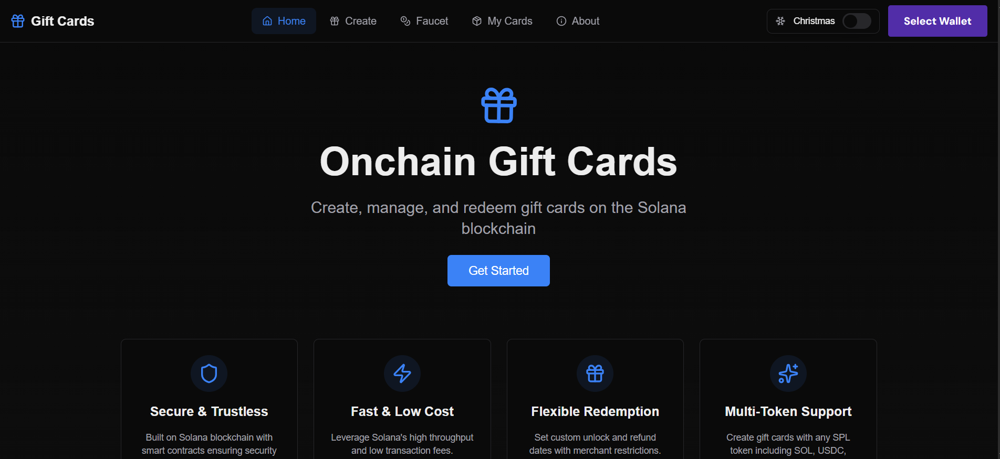

# 🎁 Onchain Gift Cards

A decentralized gift card platform built on Solana blockchain, allowing users to create, manage, and redeem gift cards with time-locked releases and merchant restrictions.


## 📸 Screenshot

<div align="center">
  
</div>


## ✨ Features

### 🎯 Core Functionality
- **Create Gift Cards**: Create multiple gift cards with custom amounts, unlock dates, and refund dates
- **Multiple Cards Support**: Create and manage multiple gift cards from a single wallet
- **Time-Locked Releases**: Set unlock dates to control when gift cards become redeemable
- **Automatic Refunds**: Configure refund dates to automatically allow balance recovery
- **Merchant Rules**: Restrict redemption to specific merchant addresses (optional)
- **SPL Token Support**: Support for any SPL token (WSOL, USDC, USDT, etc.)

### 🛡️ Security & Trust
- **Escrow System**: Funds are securely held in program-controlled escrow accounts
- **Owner Controls**: Only the card owner can refund or delete cards
- **Merchant Validation**: Optional whitelist system for approved merchants
- **Balance Checks**: Automatic validation of sufficient balances before operations

### 🎨 User Experience
- **Modern UI**: Beautiful, responsive interface with dark mode support
- **Christmas Theme**: Festive holiday theme toggle (optional)
- **Real-time Updates**: Live balance and status tracking
- **Wallet Integration**: Seamless integration with Phantom, Solflare, and other Solana wallets
- **Transaction Feedback**: Clear success/error messages with transaction links
- **Faucet Integration**: Built-in devnet faucet for easy testing

## 🏗️ Architecture

### Smart Contract (Anchor)
- **Program ID**: `GcoSaa4P2NADPsf6R5urbrUEv9SccPTP5Xjd6GznV8p`
- **Framework**: Anchor 0.30.1
- **Language**: Rust
- **Network**: Solana Devnet/Mainnet

### Frontend
- **Framework**: Next.js 16.1 with App Router
- **Language**: TypeScript
- **Styling**: Tailwind CSS 4
- **State Management**: Zustand
- **Wallet**: Solana Wallet Adapter
- **Animations**: Framer Motion

### Key Components
```
┌─────────────────────────────────────────────────────────────┐
│                    User Action Flow                          │
└─────────────────────────────────────────────────────────────┘
                            │
        ┌───────────────────┼───────────────────┐
        │                   │                   │
    CREATE              REDEEM               REFUND
        │                   │                   │
        ▼                   ▼                   ▼
┌──────────────┐   ┌──────────────┐   ┌──────────────┐
│ 1. Validate  │   │ 1. Check     │   │ 1. Verify    │
│    dates     │   │    unlocked  │   │    refund    │
│ 2. Transfer  │   │ 2. Validate  │   │    date      │
│    tokens    │   │    merchant  │   │ 2. Transfer  │
│ 3. Create    │   │ 3. Transfer  │   │    all funds │
│    accounts  │   │    tokens    │   │ 3. Set       │
│ 4. Emit event│   │ 4. Update    │   │    balance=0 │
└──────────────┘   │    balance   │   │ 4. Emit event│
                   │ 5. Emit event│   └──────────────┘
                   └──────────────┘
```

## 🚀 Quick Start

### Prerequisites

- **Node.js** 18+ and npm/yarn
- **Rust** 1.70+
- **Solana CLI** 1.18+
- **Anchor** 0.30.1+
- A Solana wallet (Phantom, Solflare, etc.)

### Installation

1. **Clone the repository**
   ```bash
   git clone <your-repo-url>
   cd onchain_gift_cards
   ```

2. **Install frontend dependencies**
   ```bash
   cd frontend
   npm install
   ```

3. **Build the smart contract**
   ```bash
   cd onchain-gift-cards-smart-contract
   anchor build
   ```

4. **Copy the IDL to frontend**
   ```bash
   # From the frontend directory
   cp onchain-gift-cards-smart-contract/target/idl/onchain_gift_cards.json lib/idl.json
   ```

5. **Configure environment variables**
   ```bash
   # Create .env.local in the frontend directory
   NEXT_PUBLIC_SOLANA_NETWORK=devnet
   # Optional: NEXT_PUBLIC_RPC_URL=https://api.devnet.solana.com
   ```

6. **Run the development server**
   ```bash
   cd frontend
   npm run dev
   ```

7. **Open your browser**
   Navigate to [http://localhost:3000](http://localhost:3000)

## 📖 Usage Guide

### Creating a Gift Card

1. Connect your Solana wallet
2. Navigate to the "Create" page
3. Fill in the form:
   - **Token**: Select the token type (WSOL, USDC, etc.)
   - **Amount**: Enter the gift card amount
   - **Unlock Date**: When the card becomes redeemable
   - **Refund Date**: When you can reclaim unused funds
   - **Merchant Rules** (Optional): Add specific merchant addresses
4. Click "Create Gift Card"
5. Approve the transaction in your wallet

### Redeeming a Gift Card

1. Navigate to "My Cards" or the "Create" page
2. Expand the gift card you want to redeem
3. Enter the merchant wallet address
4. Enter the amount to redeem
5. Click "Redeem"
6. Approve the transaction

### Refunding a Gift Card

1. Navigate to "My Cards"
2. Expand the gift card (must be past refund date)
3. Click "Refund Balance"
4. Approve the transaction
5. Funds will be returned to your wallet

### Managing Merchant Rules

1. Expand a gift card
2. Click "Edit" in the Merchant Rules section
3. Add or remove merchant addresses
4. Click "Save Rules"
5. Approve the transaction

### Getting Test Tokens

1. Navigate to the "Faucet" page
2. Request SOL airdrop (if on devnet)
3. Wrap SOL to WSOL for gift cards
4. Use official Solana faucet for other tokens

## 🔧 Smart Contract Instructions

### `create_gift_card`
Creates a new gift card with specified parameters.
- **Parameters**: `card_id`, `amount`, `unlock_date`, `refund_date`
- **Creates**: Gift card account and escrow token account
- **Transfers**: Tokens from creator to escrow

### `redeem`
Redeems tokens from a gift card to a merchant.
- **Parameters**: `card_id`, `amount`
- **Requirements**: Card must be unlocked, not expired, sufficient balance
- **Transfers**: Tokens from escrow to merchant

### `refund`
Refunds remaining balance to the card owner.
- **Parameters**: `card_id`
- **Requirements**: Refund date must have passed, balance > 0
- **Transfers**: All remaining tokens back to owner

### `rule_set`
Updates the list of allowed merchants.
- **Parameters**: `card_id`, `allowed_merchants`
- **Requirements**: Only owner can update
- **Limits**: Maximum 10 merchants

### `delete_gift_card`
Deletes an empty gift card account and reclaims rent.
- **Parameters**: `card_id`
- **Requirements**: Balance must be 0
- **Closes**: Gift card account and returns rent

## 📁 Project Structure

```
onchain_gift_cards/
├── frontend/
│   ├── app/                    # Next.js App Router pages
│   │   ├── create/            # Create gift card page
│   │   ├── my-cards/          # View all cards page
│   │   ├── faucet/            # Token faucet page
│   │   └── about/             # About page
│   ├── components/            # React components
│   │   ├── gift-cards/        # Gift card components
│   │   │   ├── CreateGiftCardForm.tsx
│   │   │   ├── GiftCardsList.tsx
│   │   │   ├── GiftCardItem.tsx
│   │   │   ├── MerchantRulesEditor.tsx
│   │   │   └── WalletConnectPrompt.tsx
│   │   ├── SolanaFaucet.tsx
│   │   └── ...                # Other UI components
│   ├── lib/                   # Utilities and hooks
│   │   ├── anchor.ts          # Anchor program setup
│   │   ├── giftCard.ts        # Gift card operations
│   │   ├── tokens.ts          # Token definitions
│   │   ├── store/             # Zustand stores
│   │   └── idl.json           # Generated IDL
│   ├── hooks/                 # Custom React hooks
│   │   └── useGiftCardOperations.ts
│   ├── utils/                 # Utility functions
│   │   └── giftCardUtils.ts
│   └── config/                # Configuration
│       └── solana.ts
│
└── frontend/onchain-gift-cards-smart-contract/
    ├── programs/
    │   └── onchain-gift-cards/
    │       └── src/
    │           ├── lib.rs              # Program entry point
    │           ├── state.rs            # Account state
    │           ├── errors.rs           # Error definitions
    │           ├── events.rs           # Event definitions
    │           └── instructions/       # Instruction handlers
    │               ├── create_gift_card.rs
    │               ├── redeem.rs
    │               ├── refund.rs
    │               ├── rule_set.rs
    │               └── delete_gift_card.rs
    ├── tests/                  # Anchor tests
    └── Anchor.toml            # Anchor configuration
```

## 🧪 Testing

### Run Smart Contract Tests
```bash
cd frontend/onchain-gift-cards-smart-contract
anchor test
```

### Run Frontend Linting
```bash
cd frontend
npm run lint
```

### Build for Production
```bash
cd frontend
npm run build
```

## 🔐 Security Considerations

- **Account Ownership**: All operations verify account ownership
- **Balance Validation**: Checks ensure sufficient funds before operations
- **Date Validation**: Unlock and refund dates are validated on-chain
- **Merchant Validation**: Optional merchant whitelist prevents unauthorized redemptions
- **Rent Exemption**: Accounts are properly sized and rent-exempt

## 🌐 Deployment

### Deploy Smart Contract

1. **Build the program**
   ```bash
   cd frontend/onchain-gift-cards-smart-contract
   anchor build
   ```

2. **Deploy to devnet**
   ```bash
   anchor deploy --provider.cluster devnet
   ```

3. **Deploy to mainnet** (⚠️ Production)
   ```bash
   anchor deploy --provider.cluster mainnet
   ```

### Deploy Frontend

1. **Build the frontend**
   ```bash
   cd frontend
   npm run build
   ```

2. **Deploy to Vercel/Netlify/etc.**
   ```bash
   # Vercel
   vercel deploy --prod
   
   # Or use your preferred hosting service
   ```

## 🤝 Contributing

Contributions are welcome! Please feel free to submit a Pull Request.

1. Fork the repository
2. Create your feature branch (`git checkout -b feature/AmazingFeature`)
3. Commit your changes (`git commit -m 'Add some AmazingFeature'`)
4. Push to the branch (`git push origin feature/AmazingFeature`)
5. Open a Pull Request

## 📝 License

This project is licensed under the MIT License - see the LICENSE file for details.

## 🙏 Acknowledgments

- [Anchor Framework](https://www.anchor-lang.com/)
- [Solana](https://solana.com/)
- [Next.js](https://nextjs.org/)
- All the amazing open-source libraries that made this possible

## 📞 Support

- **Issues**: [GitHub Issues](https://github.com/yourusername/onchain_gift_cards/issues)
- **Discussions**: [GitHub Discussions](https://github.com/yourusername/onchain_gift_cards/discussions)

## 🔗 Useful Links

- [Solana Documentation](https://docs.solana.com/)
- [Anchor Documentation](https://www.anchor-lang.com/docs)
- [Solana Cookbook](https://solanacookbook.com/)
- [Next.js Documentation](https://nextjs.org/docs)

---

**Built with ❤️ on Solana**

*Making gift cards decentralized, secure, and programmable.*
